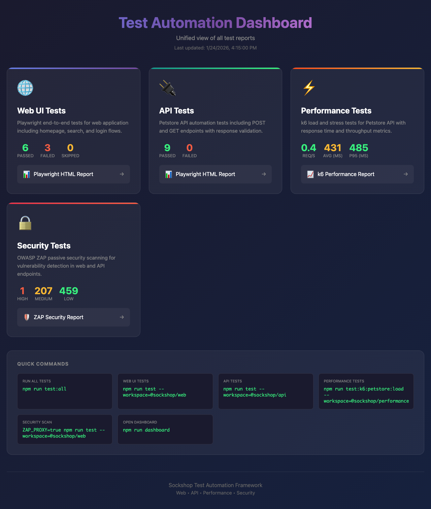
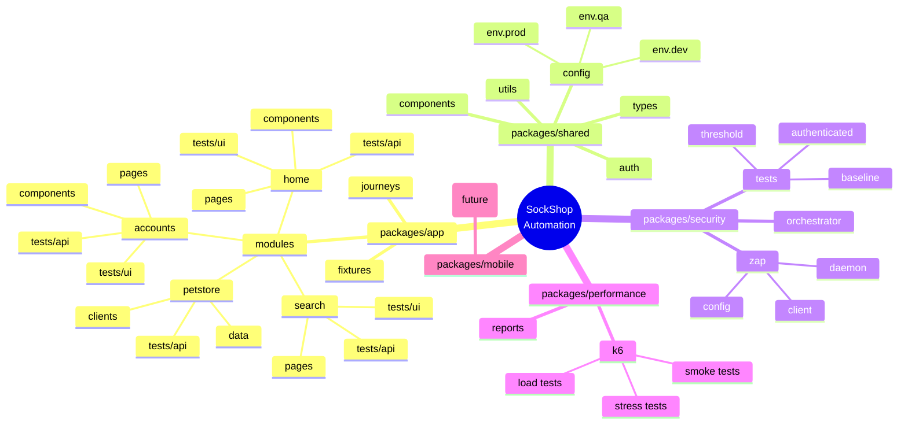

# SockShop Automation Framework

> **Enterprise-grade, multi-modular test automation framework** designed for scalable team collaboration across UI, API, Performance, and Security testing.

---

## Test Results Dashboard



**Latest Test Run (with ZAP Passive Scanning):**

| Test Type | Passed | Failed | Details |
|-----------|--------|--------|---------|
| UI Tests | 6 | 3 | Chromium, Firefox, WebKit |
| API Tests | 9 | 0 | Petstore API endpoints |
| Performance | ✓ | - | Smoke test (30s, 11 iterations) |
| **Security** | - | - | High: 1, Medium: 207, Low: 459 |

---

## Purpose

This framework solves the challenge of **scaling test automation across multiple teams** by providing:

- **Modular Architecture** - Each feature/domain has its own isolated module with UI + API tests together
- **Single Repository** - All testing types (UI, API, Performance, Security) in one monorepo
- **Team Independence** - Different teams can work on different modules without conflicts
- **Shared Utilities** - Common code (auth, config, types) shared across all packages
- **Unified Reporting** - Consolidated dashboard for all test results

---

## Framework Architecture



---

## Visual Structure

```
sockshop-automation/
│
├── packages/
│   │
│   ├── app/                          # Main application tests (UI + API)
│   │   └── src/
│   │       ├── modules/              # Feature-based modules
│   │       │   ├── accounts/         # Login, Registration
│   │       │   │   ├── pages/        # Page Objects
│   │       │   │   ├── components/   # Reusable UI components
│   │       │   │   ├── api/          # API endpoints
│   │       │   │   ├── data/         # Test data
│   │       │   │   └── tests/
│   │       │   │       ├── ui/       # UI tests
│   │       │   │       └── api/      # API tests
│   │       │   │
│   │       │   ├── home/             # Homepage module
│   │       │   ├── search/           # Search module
│   │       │   └── petstore/         # Petstore API module
│   │       │
│   │       ├── fixtures/             # Playwright fixtures
│   │       └── journeys/             # End-to-end user journeys
│   │
│   ├── shared/                       # Shared utilities & config
│   │   └── src/
│   │       ├── config/               # Environment configs (dev/qa/prod)
│   │       ├── types/                # TypeScript interfaces
│   │       ├── utils/                # Helper functions
│   │       ├── auth/                 # Authentication helpers
│   │       └── components/           # Shared UI components
│   │
│   ├── security/                     # OWASP ZAP security tests
│   │   └── src/
│   │       ├── zap/                  # ZAP client & daemon
│   │       ├── tests/                # Security test suites
│   │       └── orchestrator/         # Scan orchestration
│   │
│   ├── performance/                  # k6 load/stress tests
│   │   └── src/k6/                   # k6 test scripts
│   │
│   └── mobile/                       # Mobile tests (future)
│
├── scripts/                          # Automation scripts
├── reports/                          # Consolidated test reports
└── package.json                      # Monorepo configuration
```

---

## Key Concepts

### 1. Module-Based Testing

Each feature is a self-contained module with everything it needs:

```
modules/accounts/
├── pages/              # Page Object Model classes
│   ├── login.page.ts
│   └── register.page.ts
├── components/         # Reusable UI components
│   └── password-field.component.ts
├── api/                # API client/endpoints
│   └── accounts.endpoints.ts
├── data/               # Test data factories
│   └── users.ts
└── tests/
    ├── ui/             # UI/E2E tests
    │   └── login.ui.spec.ts
    └── api/            # API tests
        └── accounts.api.spec.ts
```

**Benefits:**
- Teams own entire modules independently
- All related code in one place
- Easy to find and maintain tests
- Clear boundaries between features

### 2. Shared Package

Common utilities used across all packages:

| Folder | Purpose |
|--------|---------|
| `config/` | Environment-specific settings (URLs, credentials, timeouts) |
| `types/` | TypeScript interfaces for type safety |
| `utils/` | Helper functions (wait, retry, random, date) |
| `auth/` | Login helpers, token management |
| `components/` | Shared UI components (header, footer, toast) |

### 3. Test Types

| Type | Package | Tool | Purpose |
|------|---------|------|---------|
| **UI Tests** | `app` | Playwright | Browser-based E2E tests |
| **API Tests** | `app` | Playwright | REST API validation |
| **Security** | `security` | OWASP ZAP | Vulnerability scanning |
| **Performance** | `performance` | k6 | Load/stress testing |
| **Mobile** | `mobile` | (TBD) | iOS/Android tests |

---

## Quick Start

### Prerequisites

- Node.js 18+
- npm 9+

### Installation

```bash
# Clone the repository
git clone <repository-url>
cd sockshop-automation

# Install all dependencies
npm install

# Install Playwright browsers
npx playwright install
```

### Running Tests

```bash
# Run all app tests (UI + API)
npm run test:app

# Run only UI tests
npm run test:ui

# Run only API tests
npm run test:api

# Run specific module
npm run test:petstore --workspace=@sockshop/app
npm run test:home --workspace=@sockshop/app
npm run test:accounts --workspace=@sockshop/app

# Run with visible browser
npm run test:headed --workspace=@sockshop/app

# Run performance tests
npm run test:perf

# Run security tests
npm run test:security
```

---

## Commands Reference

### Root Level Commands

| Command | Description |
|---------|-------------|
| `npm run test:app` | Run all tests in app package |
| `npm run test:ui` | Run all UI tests |
| `npm run test:api` | Run all API tests |
| `npm run test:perf` | Run k6 performance tests |
| `npm run test:security` | Run ZAP security tests |
| `npm run test:all` | Run tests across all packages |
| `npm run dashboard` | Open unified test dashboard |

### App Package Commands

```bash
# Navigate to app package
cd packages/app

# Or use workspace flag from root
npm run <command> --workspace=@sockshop/app
```

| Command | Description |
|---------|-------------|
| `npm run test` | Run all tests |
| `npm run test:ui` | Run UI tests only (`**/tests/ui/`) |
| `npm run test:api` | Run API tests only (`**/tests/api/`) |
| `npm run test:home` | Run home module tests |
| `npm run test:search` | Run search module tests |
| `npm run test:accounts` | Run accounts module tests |
| `npm run test:petstore` | Run petstore module tests |
| `npm run test:journeys` | Run end-to-end journeys |
| `npm run test:headed` | Run with visible browser |
| `npm run test:debug` | Run in debug mode |
| `npm run report` | Open HTML report |

---

## Environment Configuration

The framework supports multiple environments via `TEST_ENV`:

```bash
# Run tests against different environments
TEST_ENV=dev npm run test:app
TEST_ENV=qa npm run test:app
TEST_ENV=prod npm run test:app  # default
```

Configuration files:
- `packages/shared/src/config/env.dev.ts`
- `packages/shared/src/config/env.qa.ts`
- `packages/shared/src/config/env.prod.ts`

---

## Adding a New Module

1. **Create module folder structure:**

```bash
mkdir -p packages/app/src/modules/cart/{pages,components,api,data,tests/{ui,api}}
```

2. **Create page object:**

```typescript
// packages/app/src/modules/cart/pages/cart.page.ts
import { Page } from '@playwright/test';

export class CartPage {
  constructor(private page: Page) {}

  async addItem(productId: string) {
    // implementation
  }

  async getItemCount(): Promise<number> {
    // implementation
  }
}
```

3. **Create test:**

```typescript
// packages/app/src/modules/cart/tests/ui/cart.ui.spec.ts
import { test, expect } from '@playwright/test';
import { CartPage } from '../../pages/cart.page';

test.describe('Cart Module', () => {
  test('should add item to cart', async ({ page }) => {
    const cartPage = new CartPage(page);
    await cartPage.addItem('product-123');
    expect(await cartPage.getItemCount()).toBe(1);
  });
});
```

4. **Add npm script (optional):**

```json
// packages/app/package.json
"scripts": {
  "test:cart": "playwright test src/modules/cart/tests/"
}
```

---

## Security Testing with ZAP

The security package integrates OWASP ZAP for vulnerability scanning:

```bash
# Start ZAP daemon
npm run zap:start --workspace=@sockshop/security

# Run security tests (passive scanning)
npm run test:security

# Run with active scanning (attacks)
ZAP_ACTIVE_SCAN=true npm run test:security

# Check ZAP status
npm run zap:status --workspace=@sockshop/security
```

### Security Test Types

| Test | File | Description |
|------|------|-------------|
| Baseline | `baseline.security.spec.ts` | Passive scanning during user flows |
| Authenticated | `authenticated.security.spec.ts` | Scans with logged-in session |
| Threshold | `threshold.security.spec.ts` | Validates alert counts against thresholds |

---

## Performance Testing with k6

```bash
# Run load test
npm run test:perf

# Run specific test type
npm run test:k6:petstore:smoke --workspace=@sockshop/performance
npm run test:k6:petstore:load --workspace=@sockshop/performance
npm run test:k6:petstore:stress --workspace=@sockshop/performance
```

### Test Scenarios

| Scenario | VUs | Duration | Purpose |
|----------|-----|----------|---------|
| Smoke | 1 | 30s | Sanity check |
| Load | 10 | 5m | Normal load |
| Stress | 30 | 6m | Peak load |

---

## Reports & Dashboard

```bash
# Open unified dashboard
npm run dashboard

# Update dashboard with latest results
npm run dashboard:update

# View app package report
npm run reports:app
```

Reports are stored in:
- `reports/` - Consolidated dashboard
- `packages/app/reports/html/` - Playwright HTML reports
- `packages/performance/reports/` - k6 performance reports
- `packages/security/reports/` - ZAP security reports

---

## Project Dependencies

```
┌─────────────────────────────────────────────────────────┐
│                    @sockshop/app                        │
│              (UI + API Tests - Playwright)              │
└─────────────────────────┬───────────────────────────────┘
                          │
                          ▼
┌─────────────────────────────────────────────────────────┐
│                   @sockshop/shared                      │
│         (Config, Types, Utils, Auth, Components)        │
└─────────────────────────────────────────────────────────┘
                          ▲
          ┌───────────────┼───────────────┐
          │               │               │
┌─────────┴─────┐ ┌───────┴──────┐ ┌──────┴──────┐
│  @sockshop/   │ │  @sockshop/  │ │ @sockshop/  │
│   security    │ │  performance │ │   mobile    │
│    (ZAP)      │ │     (k6)     │ │   (TBD)     │
└───────────────┘ └──────────────┘ └─────────────┘
```

---

## Best Practices

### DO

- Keep modules independent and self-contained
- Write both UI and API tests for each feature
- Use page objects for UI interactions
- Use API clients for backend calls
- Share common utilities via `@sockshop/shared`
- Use environment-specific configurations
- Run security scans in CI/CD pipeline

### DON'T

- Don't create cross-module dependencies
- Don't hardcode credentials (use env vars)
- Don't skip API tests when UI tests exist
- Don't duplicate code across modules
- Don't commit sensitive data

---

## CI/CD Integration

```yaml
# Example GitHub Actions workflow
name: Test Suite

on: [push, pull_request]

jobs:
  test:
    runs-on: ubuntu-latest
    steps:
      - uses: actions/checkout@v4
      - uses: actions/setup-node@v4
        with:
          node-version: '18'

      - run: npm ci
      - run: npx playwright install --with-deps

      - name: Run UI Tests
        run: npm run test:ui

      - name: Run API Tests
        run: npm run test:api

      - name: Run Performance Tests
        run: npm run test:perf

      - name: Upload Reports
        uses: actions/upload-artifact@v4
        with:
          name: test-reports
          path: reports/
```

---

## Troubleshooting

| Issue | Solution |
|-------|----------|
| Browser not found | `npx playwright install` |
| Module not found | `npm install` from root |
| TypeScript errors | Check `tsconfig.json` paths |
| ZAP not running | `npm run zap:start --workspace=@sockshop/security` |
| k6 not found | Install k6: `brew install k6` (macOS) |

---

## Contributing

1. Create a new branch from `main`
2. Add your module/tests following the structure
3. Ensure all tests pass: `npm run test:all`
4. Submit a pull request

---

## License

ISC

---

<p align="center">
  <b>Built for Scale. Designed for Teams.</b>
</p>
